# Jet Identification Deep Neural Network (JIDENN) 
Guark/gluon jet tagging with Transformers
[Documentation](http://jansam.wieno.sk/JIDENN)

<p align="center">
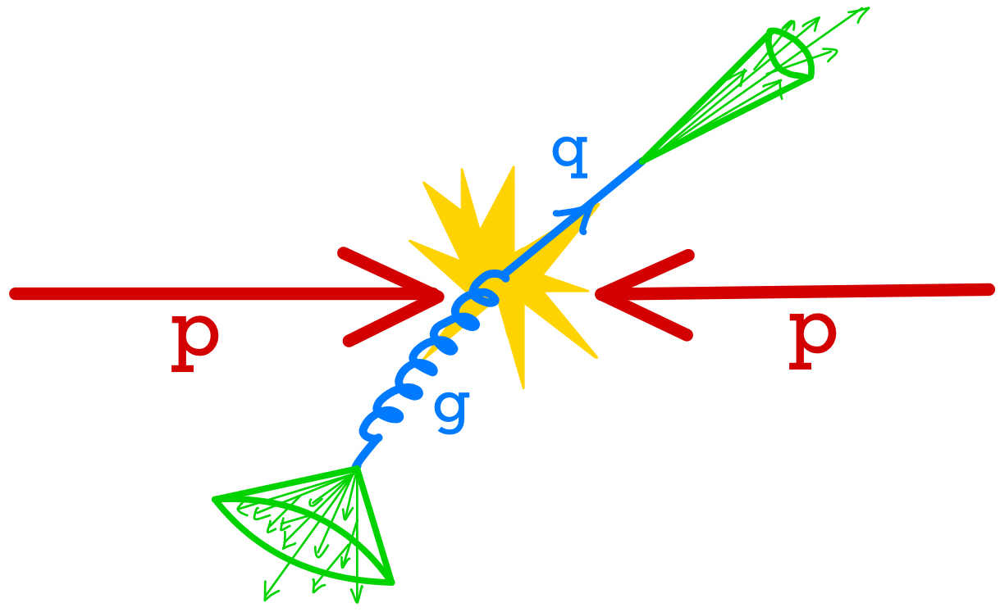
</p>

## Introduction 
This project provides a framework for the development of deep neural networks for jet identification. 
Jet identification is the task of classifying jets as originating from either quarks or gluons.

There are two main approaches to jet identification:
- utilizing high-level features of jets
- utilizing the full jet constituents
  
Both can be tackled with deep neural networks.

## Usage
First, clone the repository and install the requirements:
``` bash
git clone https://github.com/jansam123/JIDENN
cd JIDENN
pip install -r requirements.txt
```

If your data comes in the form of ROOT files, you need to convert them to `tf.data.Dataset` objects with the `convert_root.py` script:
``` bash
python convert_root.py --save_path /path/to/individual/dataset --file_path /path/to/data.root 
```
Do this for all your data files.
Afterward, the data must be preprocessed with the `event_flattening.py` script, which performs cuts, flattens the events to individual jets, and combines the data from different files into one dataset:
``` bash
python event_flattening.py --save_path /path/to/save/big_dataset --file_path /path/to/individual/dataset --num_shards 128
```
With the `--num_shards` argument, you can specify the number of shards to split the `tf.data.Dataset` into. This is useful for large datasets, as it allows for parallel processing.

Afterward, you need to configure the training inside the `jidenn/config/config.yaml` folder. The configuration is done using the Hydra framework (https://hydra.cc/). See the documentation for more details. 

Finally, you can start the training with the `jidenn/train.py` script, which loads the configuration automatically:
``` bash
python train.py
```

The evaluation is configured with the `jidenn/config/eval_config.yaml` file and can be started with the `jidenn/eval.py` script:
``` bash
python eval.py
```

Hydra also allows for changing the configuration from the command line. For example, you can change the number of epochs with:
``` bash
python train.py dataset.epochs=10
```

For more information about usage see the [documentation.](http://jansam.wieno.sk/JIDENN)


## Data Format
The data is mainly stored in the ROOT files. In the `jidenn/data` folder is a submodule that converts the ROOT files to saved `tf.data.Dataset` objects. This provides a fast, easy, and flexible way to load the data and create the train inputs for the neural networks. 

The data preprocessing consists of two steps:
- **Offline preprocessing**: The data is converted to `tf.data.Dataset` objects and saved to disk. This is done with the `jidenn/data/ROOTDataset` submodule scripts `convert_root.py` and `event_flattening.py`. The first script purely converts the ROOT files to `tf.data.Dataset` objects. The second script performs cuts and flattens the events to individual jets, as seen in figure below.
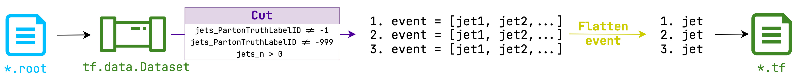

- **Online preprocessing**: As the data comes from different JZ slices, there are specific cuts on each of them separately, as seen in the diagram below. Afterward, the datasets are individually resampled, such that the amount of quarks and gluons is the same in each slice. The datasets are interleaved with equal probabilty and train input variables are created (`jidenn/data/TrainInput`). In the end, the variables are normalized.
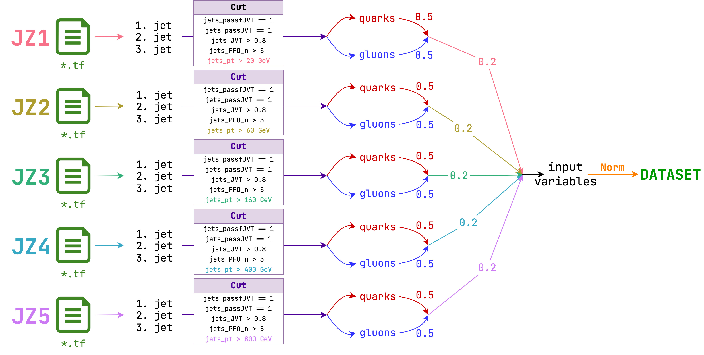

## Architecture
In the following sections, we briefly introduce the implemented architecture.
### Dynamically Enhanced Particle Transformer (DeParT)
Dynamically Enhanced Particle Transformer is an extension of ParT (explained below). It uses several minor improvements based on the DeiT III paper (https://arxiv.org/abs/2204.07118), from which the Talking Multi-heads Attention is the most improtant. The architecture is shown in the figure below.

<p align="center">
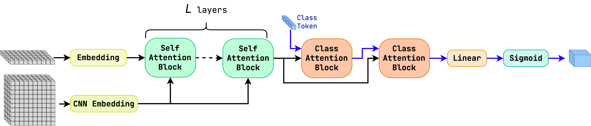
</p>
<p align="center">
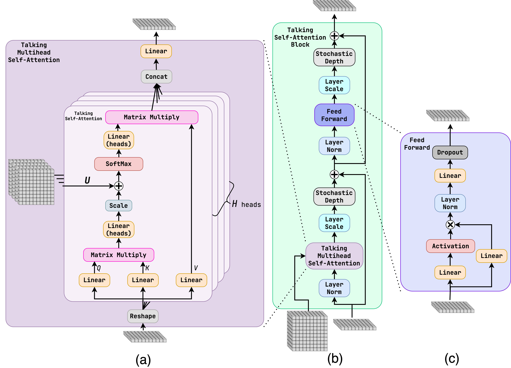
</p>
<p align="center">
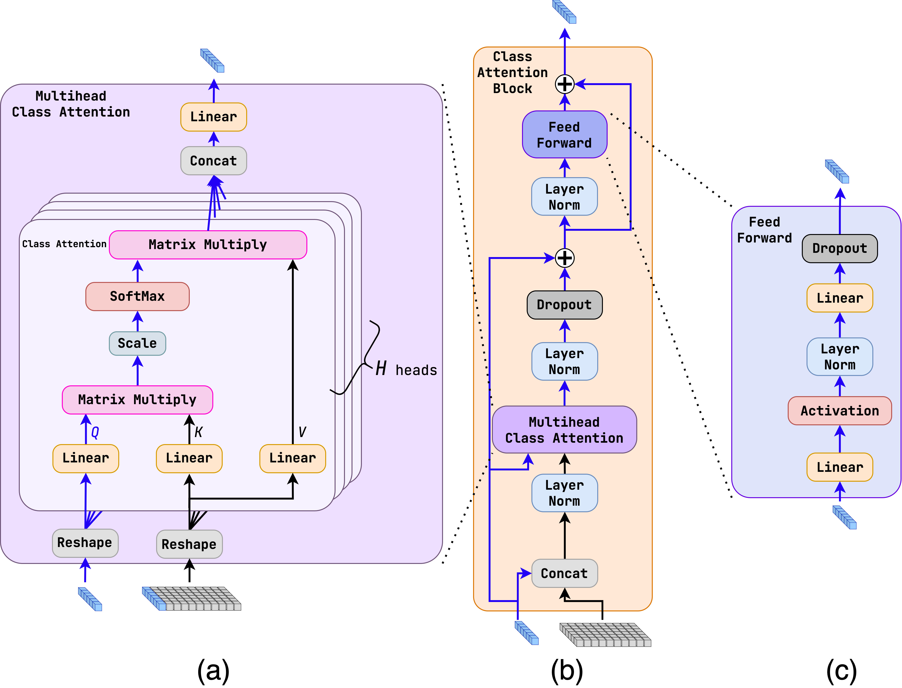
</p>

### Fully Connected Network (FC)
Fully connected (FC) or multi-layer perceptron (MLP) is a simple neural network architecture (https://ieeexplore.ieee.org/document/7238334), which uses the high-level features of jets. The architecture is shown in the figure below.
<p align="center">
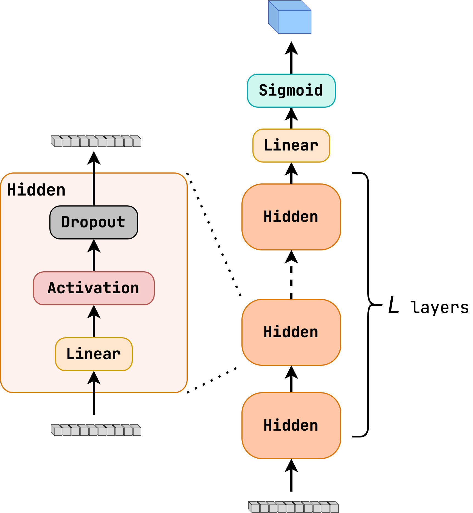
</p>

### Highway Network 
Highway network (https://arxiv.org/abs/1505.00387) is an extension of FC, which uses gated hidden layers to allow a bypass of a layer. It also uses the high-level features of jets. The architecture is shown in the figure below.
<p align="center">
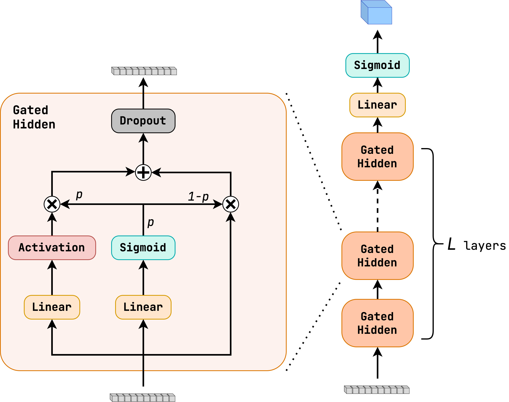
</p>

### Particle Flow Network (PFN) and Energy Flow Network (EFN)
Particle Flow Network (https://arxiv.org/abs/1810.05165) is a constituent-based architecture. It uses a per-particle mapping to an internal representation (usually with FC layers). The internal representation is then summed up to a jet representation, which is followed by FC layers. The architecture is shown in the figure below (a). 

Energy Flow Network (https://arxiv.org/abs/1810.05165) is a subset of PFN because it only uses the angular information about the jet constituents to make the per-particle mapping. The energy information is then multiplied with the angular information, again followed by FC layers. This special case of PFN make the architecture **Infrared and Collinear (IRC) safe**. The architecture is shown in the figure below (b).

<p align="center">
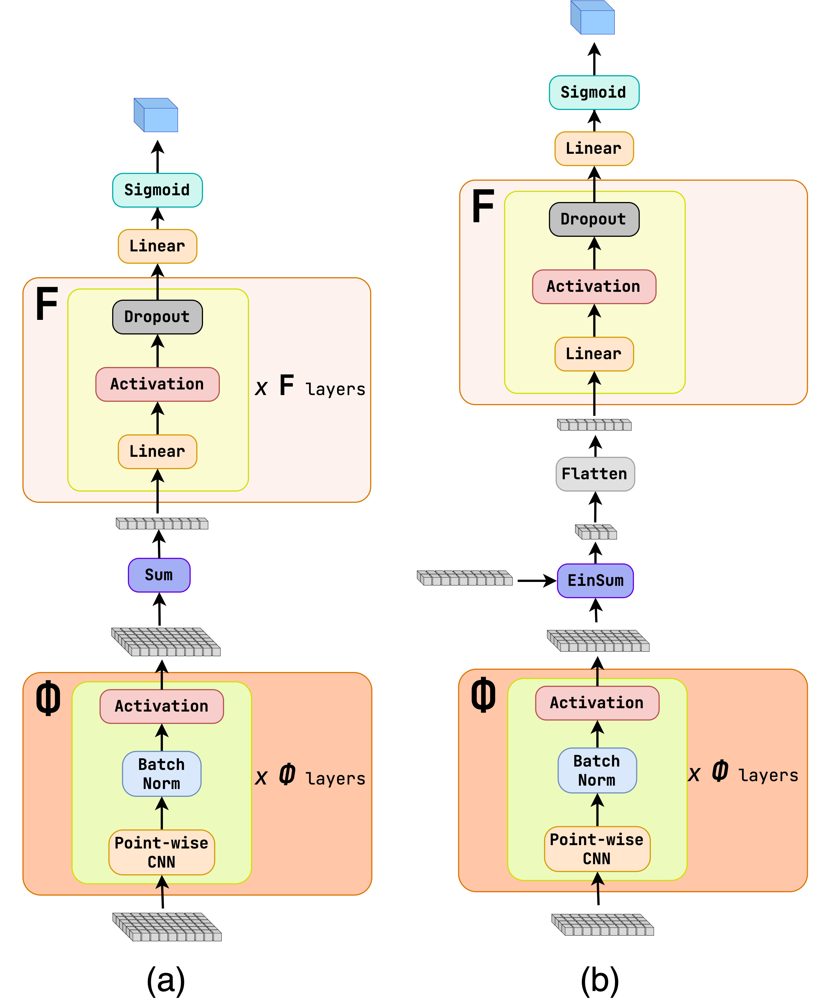
</p>

### Transformer
Transformer network (https://arxiv.org/abs/1706.03762) is a constituent-based architecture. It uses the self-attention mechanism to allow the particles to exchange information. The architecture is shown in the figure below.

<p align="center">
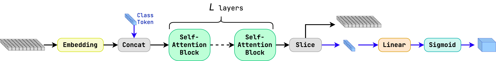
</p>
<p align="center">

</p>

### Particle Transformer (ParT)
Particle Transformer (https://arxiv.org/abs/2202.03772) is an extension of Transformer, which is based on the CaiT model used in image recognition (https://arxiv.org/abs/2103.17239). On top of that, it introduces **interaction variables** that are computed for each pair of particles. They are added as a bias to the attention weights. The architecture is shown in the figure below. 

<p align="center">

</p>
<p align="center">
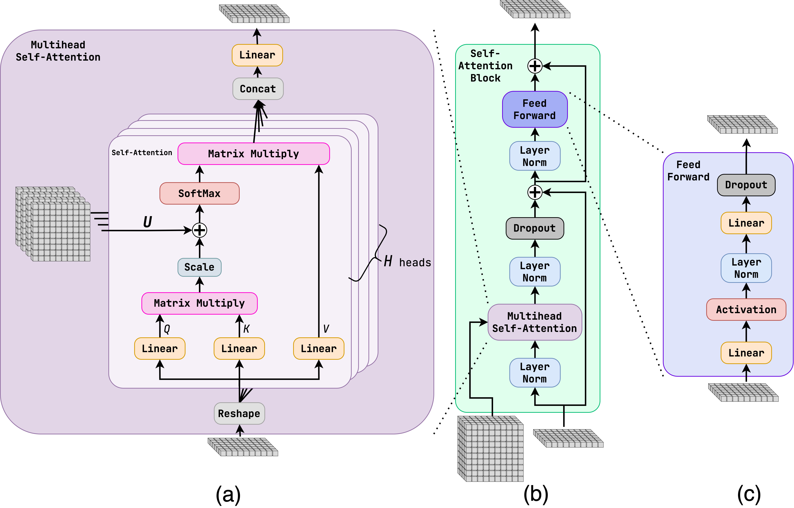
</p>
<p align="center">

</p>


