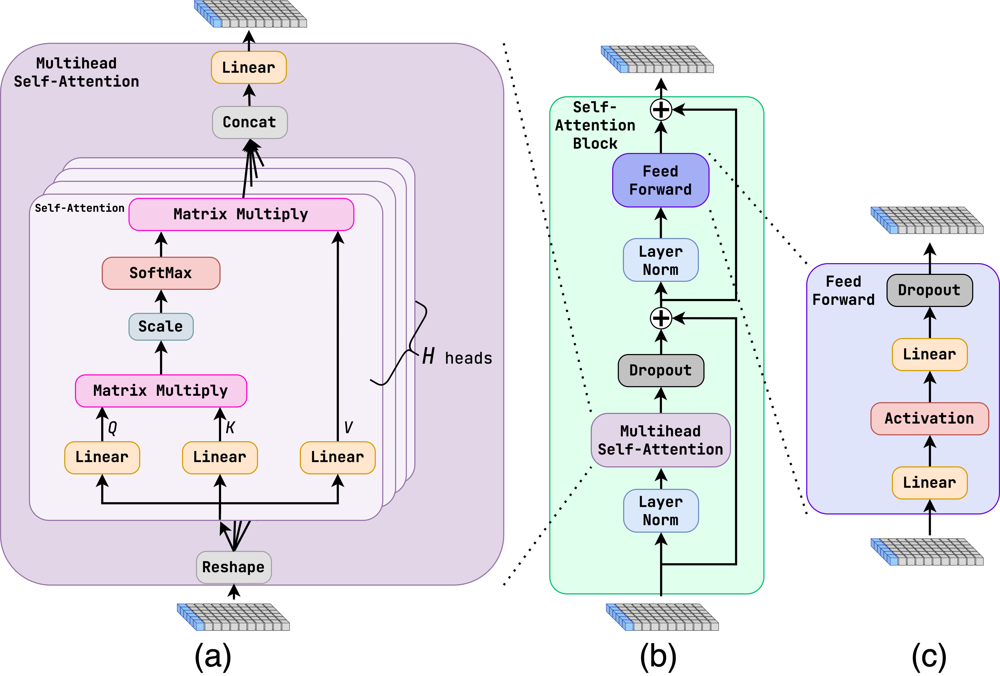

# Jet Identification Deep Neural Network (JIDENN) 
Guark/gluon jet tagging with Transformers

- [Documentation](http://jansam.wieno.sk/JIDENN)
- [Bachelor Thesis](http://hdl.handle.net/20.500.11956/182597)
- [ATLAS PUB Note](https://cds.cern.ch/record/2878932)

<p align="center">

</p>

## Introduction 
This project provides a **TensorFlow** framework for the development of deep neural networks for quark gluon jet taggers. 
Quark gluon jet tagging is the task of classifying jets as originating from either quarks or gluons.

There are two main approaches to jet identification:
- utilizing high-level features of jets
- utilizing the full jet constituents
  
Both can be tackled with this framework.

**Following architectures are implemented in `jidenn/models` directory (see the [architecture section](#architecture) for more details):**
- Dynamically Enhanced Particle Transformer (DeParT)
- Particle Transformer (ParT)
- Vanilla Transformer
- ParticleNet
- Particle Flow Network (PFN)
- Energy Flow Network (EFN)
- Fully Connected Network (FC)
- Highway Network

## Usage
First, clone the repository and install the requirements:
``` bash
git clone https://github.com/jansam123/JIDENN
cd JIDENN
python -m venv venv
source venv/bin/activate
pip install -r requirements.txt # or requirements_no_version.txt
```

If your data comes in the form of ROOT files, you need to convert them to `tf.data.Dataset` objects with the `scripts/convert_root.py` script:
``` bash
python convert_root.py --save_path /path/to/individual/dataset --load_path /path/to/data.root 
```
Do this for all your data files.
There are more advanced scripts, that allow for parallel processing, namely `scripts/convert_root_batched.py` processes only a subset of events, and `scripts/combine_ds_from_single_root_file.py` combines the data from a single file into one dataset.
These datasets can be further combined with a `scripts/combine_files.py` script.

Afterward, the data must be preprocessed to have a given feature with a flat spectrum. This is done with the `scripts/flatten_spectrum.py` script. 
The script also flattens the events to individual jets.

For creating a dataset with a physical spectrum (e.g. for testing) use `scripts/create_phys_spec.py`.
This script also flattens the events to individual jets.


Finally, you can start the training with the `jidenn/train.py` script, which loads the configuration automatically:
``` bash
python train.py
```
Configuration is done with the `jidenn/yaml_config/config.yaml` file.

The evaluation is configured with the `jidenn/yaml_config/eval_config.yaml` file and can be started with the `evaluation.py` script:
``` bash
python evaluation.py
```
This script can evaluate multiple models at once.
If you want to evaluate only one model, you can use the `evaluation_single.py` configured with the `jidenn/yaml_config/single_eval_config.yaml` file:
``` bash
python evaluation_single.py
```

Hydra also allows for changing the configuration from the command line. For example, you can change the number of epochs with:
``` bash
python train.py dataset.epochs=10
```

For more usage information see the [documentation.](http://jansam.wieno.sk/JIDENN)
**Some of the scripts are not yet documented, or the documentation is not up to date as the project is still under fast development.**


## Architectures
In the following sections, we briefly introduce the implemented architecture.
### Dynamically Enhanced Particle Transformer (DeParT)
Dynamically Enhanced Particle Transformer is an extension of ParT (explained below). It uses several minor improvements based on the DeiT III paper (https://arxiv.org/abs/2204.07118), from which the Talking Multi-heads Attention is the most important. The architecture is shown in the figures below.

<p align="center">

</p>
<p align="center">

</p>
<p align="center">

</p>

### Fully Connected Network (FC)
Fully connected (FC) or multi-layer perceptron (MLP) is a simple neural network architecture (https://ieeexplore.ieee.org/document/7238334), which uses the high-level features of jets. The architecture is shown in the figure below.
<p align="center">

</p>

### Highway Network 
Highway network (https://arxiv.org/abs/1505.00387) is an extension of FC, which uses gated hidden layers to allow a bypass of a layer. It also uses the high-level features of jets. The architecture is shown in the figure below.
<p align="center">

</p>

### Particle Flow Network (PFN) and Energy Flow Network (EFN)
Particle Flow Network (https://arxiv.org/abs/1810.05165) is a constituent-based architecture. It uses a per-particle mapping to an internal representation (usually with FC layers). The internal representation is then summed up to a jet representation, which is followed by FC layers. The architecture is shown in the figure below (a). 

Energy Flow Network (https://arxiv.org/abs/1810.05165) is a subset of PFN because it only uses the angular information about the jet constituents to make the per-particle mapping. The energy information is then multiplied with the angular information, again followed by FC layers. This special case of PFN make the architecture **Infrared and Collinear (IRC) safe**. The architecture is shown in the figure below (b).

<p align="center">

</p>

### Transformer
Transformer network (https://arxiv.org/abs/1706.03762) is a constituent-based architecture. It uses the self-attention mechanism to allow the particles to exchange information. The architecture is shown in the figures below.

<p align="center">

</p>
<p align="center">

</p>

### Particle Transformer (ParT)
Particle Transformer (https://arxiv.org/abs/2202.03772) is an extension of Transformer, which is based on the CaiT model used in image recognition (https://arxiv.org/abs/2103.17239). On top of that, it introduces **interaction variables** that are computed for each pair of particles. They are added as a bias to the attention weights. The architecture is shown in the figures below. 

<p align="center">

</p>
<p align="center">

</p>
<p align="center">

</p>

### ParticleNet
ParticleNet (https://arxiv.org/abs/1902.08570) is a Graph Neural Network, which uses constituents as inputs. It uses several EdgeConv layers (https://arxiv.org/abs/1801.07829) to aggregate the information from the neighbors. The neighbors are defined by the k-nearest neighbors algorithm. 


