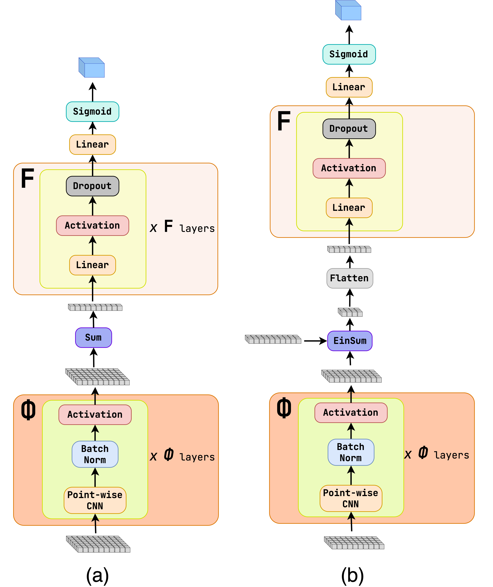

Module jidenn.models.EFN
========================
Module implementing the Energy Flow Network (EFN) model.
See https://energyflow.network for original implementation or
the paper https://arxiv.org/abs/1810.05165 for more details.

The input are the jet consituents, i.e. the particles in the jet foorming an input shape of `(batch_size, num_particles, num_features)`.
The angular features are mapped with the Phi mapping, afterwards the energy variables are multiplied by the angular features 
of each constituent separately and summed up. A F function is applied to the summed features forming an output
$$ \mathrm{output} = F\left(\sum_i \pmb{E_i} \Phi{(\eta_i,\phi_i)}\right) $$

The F function is any function, which is applied to the summed features. The default is a fully-connected network.
The mapping Phi can be a fully-connected network or a convolutional network. The default is a fully-connected network.

The energy part of the input is not used in the model to maintain **Infrared and Collinear safety** of the model.


On the left is the PFN model, on the right the EFN model.

Classes
-------

`EFNModel(input_shape: Tuple[None, int], Phi_sizes: List[int], F_sizes: List[int], output_layer: keras.engine.base_layer.Layer, activation: Callable[[tensorflow.python.framework.ops.Tensor], tensorflow.python.framework.ops.Tensor], Phi_backbone: Literal['cnn', 'fc'] = 'fc', batch_norm: bool = False, Phi_dropout: Optional[float] = None, F_dropout: Optional[float] = None, preprocess: Optional[keras.engine.base_layer.Layer] = None)`
:   The Energy Flow Network model.
    
    The input is expected to be a tensor of shape `(batch_size, num_particles, num_features=8)`,
    where the last 3 features are angular and the first 5 features are energy based.
    The second dimension is ragged, as the number of particles in each jet is not the same.
    See `jidenn.data.TrainInput.ConstituentVariables` for more details. 
    
    The model already contains the `tf.keras.layers.Input` layer, so it can be used as a standalone model.
    
    Args:
        input_shape (Tuple[None, int]): The shape of the input.
        Phi_sizes (List[int]): The sizes of the Phi layers.
        F_sizes (List[int]): The sizes of the F layers.
        output_layer (tf.keras.layers.Layer): The output layer.
        activation (Callable[[tf.Tensor], tf.Tensor]) The activation function for the Phi and F layers. 
        Phi_backbone (str, optional): The backbone of the Phi mapping. Options are "cnn" or "fc". Defaults to "fc".
            This argument is not in the config option, as the CNN backbone is not used in the paper and 
            might violate the Infrared and Collinear safety of the model. 
        batch_norm (bool, optional): Whether to use batch normalization. Defaults to False.
            This argument is not in the config option, as it is not used in the paper and 
            might violate the Infrared and Collinear safety of the model.
        F_dropout (float, optional): The dropout rate for the F layers. Defaults to None.
        preprocess (tf.keras.layers.Layer, optional): The preprocessing layer. Defaults to None.

    ### Ancestors (in MRO)

    * keras.engine.training.Model
    * keras.engine.base_layer.Layer
    * tensorflow.python.module.module.Module
    * tensorflow.python.trackable.autotrackable.AutoTrackable
    * tensorflow.python.trackable.base.Trackable
    * keras.utils.version_utils.LayerVersionSelector
    * keras.utils.version_utils.ModelVersionSelector

    ### Methods

    `cnn_Phi(self, inputs: tensorflow.python.framework.ops.Tensor) ‑> tensorflow.python.framework.ops.Tensor`
    :   Convolutional Phi mapping.
        
        Args:
            inputs (tf.Tensor): The input tensor of shape `(batch_size, num_particles, num_features)`.
        
        Returns:
            tf.Tensor: The output tensor of shape `(batch_size, num_particles, Phi_sizes[-1])`.

    `fc_F(self, inputs: tensorflow.python.framework.ops.Tensor) ‑> tensorflow.python.framework.ops.Tensor`
    :   Fully connected F mapping.
        
        Args:
            inputs (tf.Tensor): The input tensor of shape `(batch_size, num_features)`.
        
        Returns:
            tf.Tensor: The output tensor of shape `(batch_size, F_sizes[-1])`.

    `fc_Phi(self, inputs: tensorflow.python.framework.ops.Tensor) ‑> tensorflow.python.framework.ops.Tensor`
    :   Fully connected Phi mapping.
        
        Args:
            inputs (tf.Tensor): The input tensor of shape `(batch_size, num_particles, num_features)`.
        
        Returns:
            tf.Tensor: The output tensor of shape `(batch_size, num_particles, Phi_sizes[-1])`.

`EinsumLayer(equation: str)`
:   This is needed to wrap the einsum operation, because the einsum operation produces an error when loded from a saved model with tf.keras.models.load_model.
    For more information see https://github.com/keras-team/keras/issues/15783.
    For more information about the einsum operation see https://www.tensorflow.org/api_docs/python/tf/einsum.
    
    Example:
    ```python
    x = EinsumLayer("bmhwf,bmoh->bmowf")((x1, x2))
    ```
    Args:
        equation (str): The equation to be used in the einsum operation.

    ### Ancestors (in MRO)

    * keras.engine.base_layer.Layer
    * tensorflow.python.module.module.Module
    * tensorflow.python.trackable.autotrackable.AutoTrackable
    * tensorflow.python.trackable.base.Trackable
    * keras.utils.version_utils.LayerVersionSelector

    ### Methods

    `call(self, inputs: Tuple[tensorflow.python.framework.ops.Tensor, tensorflow.python.framework.ops.Tensor]) ‑> tensorflow.python.framework.ops.Tensor`
    :   Call the layer.
        
        Args:
            inputs (Tuple[tf.Tensor, tf.Tensor]): The inputs to the layer with shapes described in the equation.
        
        Returns:
            tf.Tensor: The output of the layer.

    `get_config(self)`
    :   Returns the config of the layer.
        
        A layer config is a Python dictionary (serializable)
        containing the configuration of a layer.
        The same layer can be reinstantiated later
        (without its trained weights) from this configuration.
        
        The config of a layer does not include connectivity
        information, nor the layer class name. These are handled
        by `Network` (one layer of abstraction above).
        
        Note that `get_config()` does not guarantee to return a fresh copy of
        dict every time it is called. The callers should make a copy of the
        returned dict if they want to modify it.
        
        Returns:
            Python dictionary.