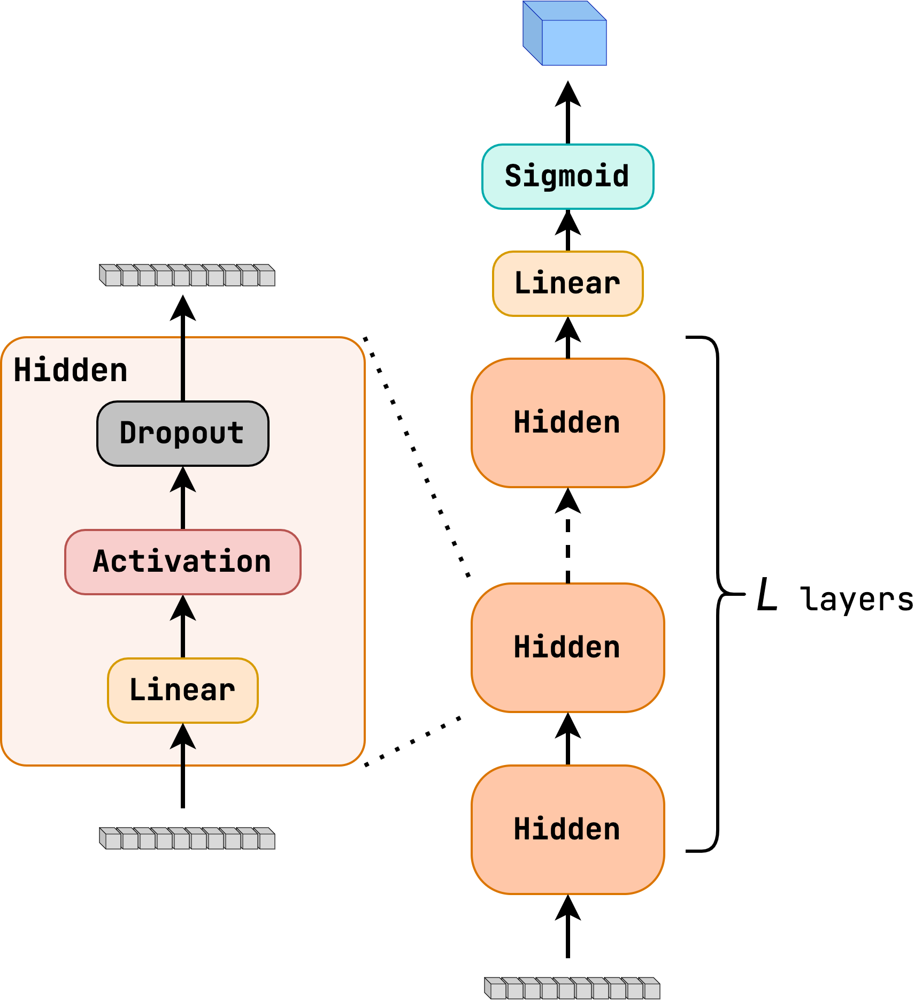

Module jidenn.models.FC
=======================
Implements a fully connected neural network, i.e. a multi-layer perceptron following the traditional notation,
a layer is a linear transformation followed by an activation function (implicit einstein sumation convention):
$$ x^{(l+1)}_i = f(W^{(l)}_{ij} x^{(l)}_j + b^{(l)}_i) $$
where $x^{(l)}_i$ is the $i$-th neuron in layer $l$, $W^{(l)}_{ij}$ is the weight between $i$-th neuron in layer $l$, 
f is the activation function, and $b^{(l)}_i$ is the bias of the $i$-th neuron in layer $l$.

Classes
-------

`FCModel(layer_size: int, num_layers: int, input_size: int, output_layer: keras.engine.base_layer.Layer, activation: Callable[[tensorflow.python.framework.ops.Tensor], tensorflow.python.framework.ops.Tensor], dropout: Optional[float] = None, preprocess: Optional[keras.engine.base_layer.Layer] = None)`
:   Implements a fully connected neural network, i.e. a multi-layer perceptron.
    
    The expected input shape is `(batch_size, input_size)`.
    
    The model already contains the `tf.keras.layers.Input` layer, so it can be used as a standalone model.
    
    
    Args:
        layer_size (int): The number of neurons in each hidden layer.
        num_layers (int): The number of hidden layers.
        output_layer (tf.keras.layers.Layer): The output layer of the model.
        activation (Callable[[tf.Tensor], tf.Tensor]) The activation function to use in the hidden layers.
        dropout (float, optional): The dropout rate to use in the hidden layers. Defaults to None.
        preprocess (tf.keras.layers.Layer, optional): The preprocessing layer to use. Defaults to None.

    ### Ancestors (in MRO)

    * keras.engine.training.Model
    * keras.engine.base_layer.Layer
    * tensorflow.python.module.module.Module
    * tensorflow.python.trackable.autotrackable.AutoTrackable
    * tensorflow.python.trackable.base.Trackable
    * keras.utils.version_utils.LayerVersionSelector
    * keras.utils.version_utils.ModelVersionSelector

    ### Methods

    `hidden_layers(self, inputs: tensorflow.python.framework.ops.Tensor) ‑> tensorflow.python.framework.ops.Tensor`
    :   Executes the hidden layers of the model.
        
        Args:
            inputs (tf.Tensor): The input tensor of shape `(batch_size, input_size)`.
        
        Returns:
            tf.Tensor: The output tensor of shape `(batch_size, layer_size)`.