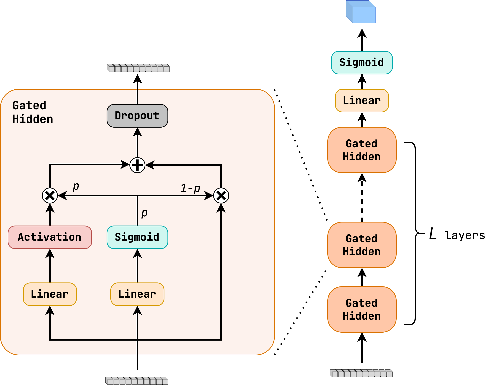

Module jidenn.models.Highway
============================
Implementation of the Highway Network model based on the paper https://arxiv.org/abs/1505.00387.

It is an extension of fully-connected networks, which allows the network to learn to skip layers.
The $i$-th layer is computed as (implicit einstein sumation convention)
$$ x^{(l+1)}_i = f(W^{(l)}_{ij} x^{(l)}_j + b^{(l)}_i) (1-p) + x^{(l)}_i p $$
where $p$ is the probability of skipping the layer. It is computed 
from the input as 
$$ p = \sigma (W^{(l)}_{ij, p} x_j + b_{i, p}) $$
with the sigmoid activation function $\sigma$ giving the probability of skipping the layer. 

The main advantage of the Highway Network is that it allows the network to learn to skip layers,
i.e. not having to learn the identity function or relearning the same function in each layer.

These Highway based models have a tendency to **not diverge** if the depth of the network is increased,
as may happen with the fully connected networks.

Classes
-------

`HighwayModel(layer_size: int, num_layers: int, input_size: int, output_layer: keras.engine.base_layer.Layer, activation: Callable[[tensorflow.python.framework.ops.Tensor], tensorflow.python.framework.ops.Tensor], dropout: Optional[float] = None, preprocess: Optional[keras.engine.base_layer.Layer] = None)`
:   Implements a Highway Network model.
    
    The expected input shape is `(batch_size, input_size)`.
    
    The model already contains the `tf.keras.layers.Input` layer, so it can be used as a standalone model.
    
    Args:
        layer_size (int): The number of neurons in each hidden layer.
        num_layers (int): The number of hidden layers.
        input_size (int): The size of the input.
        output_layer (tf.keras.layers.Layer): The output layer of the model.
        activation (Callable[[tf.Tensor], tf.Tensor]) The activation function to use in the hidden layers.
        dropout (float, optional): The dropout rate to use in the hidden layers. Defaults to None.
        preprocess (tf.keras.layers.Layer, optional): The preprocessing layer to use. Defaults to None.

    ### Ancestors (in MRO)

    * keras.engine.training.Model
    * keras.engine.base_layer.Layer
    * tensorflow.python.module.module.Module
    * tensorflow.python.trackable.autotrackable.AutoTrackable
    * tensorflow.python.trackable.base.Trackable
    * keras.utils.version_utils.LayerVersionSelector
    * keras.utils.version_utils.ModelVersionSelector

    ### Methods

    `gated_hidden_layers(self, inputs: tensorflow.python.framework.ops.Tensor) ‑> tensorflow.python.framework.ops.Tensor`
    :   Computes the hidden layers of the model.
        
        Args:
            inputs (tf.Tensor): The input tensor of shape `(batch_size, input_size)`.
        
        Returns:
            tf.Tensor: The output tensor of shape `(batch_size, layer_size)`.