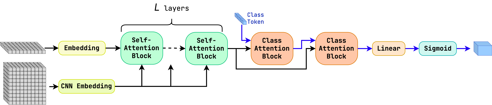
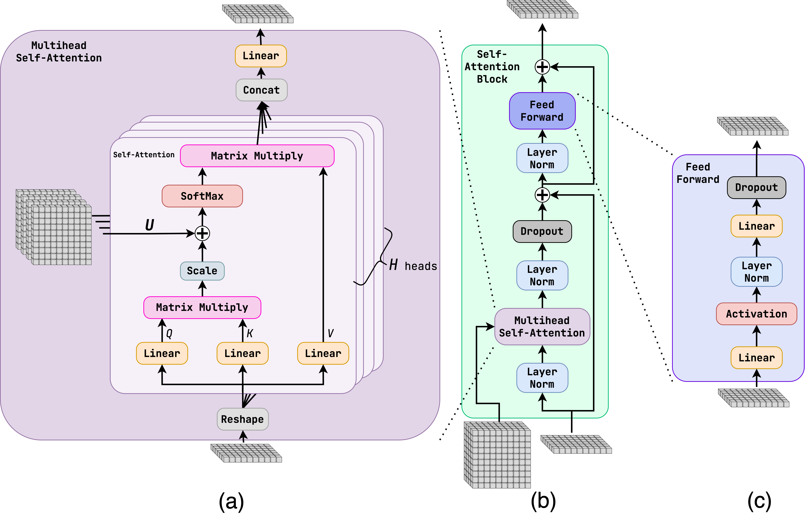
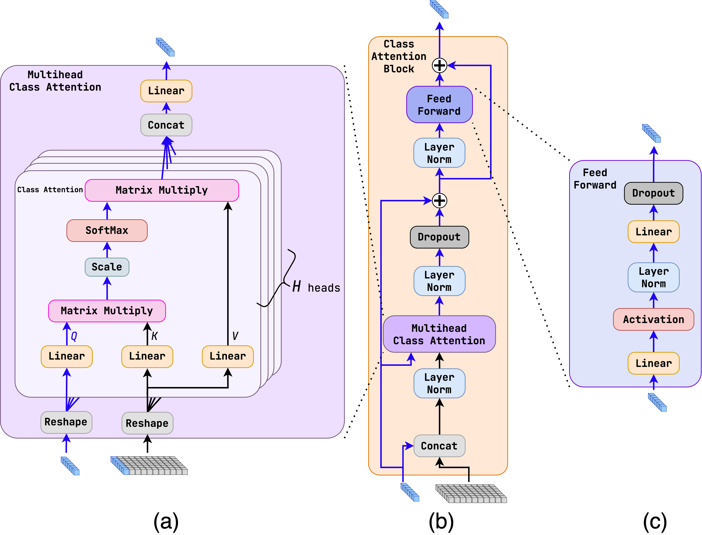

Module jidenn.models.ParT
=========================
Implementation of Particle Transformer model based on the paper https://arxiv.org/abs/2202.03772.

This model is a transformer model based on the CaiT transformer model (https://arxiv.org/abs/2103.17239), used in image classification tasks.
On top of the `jidenn.models.Transformer` model, it adds a ClassAttention layers, which allows a more effective feature extraction.
It also includes more layer normalization layers.

The only difference from CaiT, which is a novelty of this model, is the use of **interaction variables**.
These are variables caomputed for each pair of intput particles, which are then used when calculating the attention weights as 
$$ \mathrm{Attention}(Q, K) = \mathrm{softmax} \left( \frac{QK^T}{\sqrt{d_k}} + U \right)$$
where $U$ is the interaction matrix of shape `(batch, num_particles, num_particles, heads)`, where each `head` gets its own interaction matrix.

Classes
-------

`CNNEmbedding(num_layers: int, layer_size: int, out_dim: int, activation: Callable[[tensorflow.python.framework.ops.Tensor], tensorflow.python.framework.ops.Tensor])`
:   Embedding layer of the interaction variables as a series of point-wise convolutional layers.
    The interaction variiables are compuetd for each pair of particles.
    This creates a redundancy in the input, as the matrix is symetric and the diagonal is always zero.
    To save computation, the upper triangular part of the matrix is used as input, which is 
    flattend and the 1D convolutions are applied to it.
    
    Args:
        num_layers (int): number of convolutional layers
        layer_size (int): number of channels of the hidden layers
        out_dim (int): number of channels of the last convolutional layer which 
            is manually appended as an extra layer after `num_layers` layers.
        activation (Callable[[tf.Tensor], tf.Tensor]) activation function

    ### Ancestors (in MRO)

    * keras.engine.base_layer.Layer
    * tensorflow.python.module.module.Module
    * tensorflow.python.trackable.autotrackable.AutoTrackable
    * tensorflow.python.trackable.base.Trackable
    * keras.utils.version_utils.LayerVersionSelector

    ### Methods

    `call(self, inputs: tensorflow.python.framework.ops.Tensor) ‑> tensorflow.python.framework.ops.Tensor`
    :   Forward pass of the interaction embedding layer
        
        Args:
            inputs (tf.Tensor): input tensor of shape `(batch_size, num_particles, num_particles, num_features)`
                This matrix is assumed to be symetric, with zero diagonal, with only the upper-triag part 
                can be used fopr embedding. 
        
        Returns:
            tf.Tensor: output tensor of shape `(batch_size, num_particles, num_particles, out_dim)`

    `get_config(self)`
    :   Returns the config of the layer.
        
        A layer config is a Python dictionary (serializable)
        containing the configuration of a layer.
        The same layer can be reinstantiated later
        (without its trained weights) from this configuration.
        
        The config of a layer does not include connectivity
        information, nor the layer class name. These are handled
        by `Network` (one layer of abstraction above).
        
        Note that `get_config()` does not guarantee to return a fresh copy of
        dict every time it is called. The callers should make a copy of the
        returned dict if they want to modify it.
        
        Returns:
            Python dictionary.

`ClassAttentionBlock(dim: int, heads: int, expansion: int, dropout: Optional[float] = None)`
:   Class attention block.
    It allows the class token to attend to the input particles, and then feed the attended class token
    to the feed-forward network with residual connections and layer normalizations.
    
    This extracts the class information from the attented particles more effectively.
    
    Args:
        dim (int): dimension of the input and output
        heads (int): number of heads
        dropout (float, optional): dropout rate. Defaults to None.
        expansion (int): expansion factor of the hidden layer, i.e. the hidden layer has size `dim * expansion`

    ### Ancestors (in MRO)

    * keras.engine.base_layer.Layer
    * tensorflow.python.module.module.Module
    * tensorflow.python.trackable.autotrackable.AutoTrackable
    * tensorflow.python.trackable.base.Trackable
    * keras.utils.version_utils.LayerVersionSelector

    ### Methods

    `call(self, inputs: tensorflow.python.framework.ops.Tensor, class_token: tensorflow.python.framework.ops.Tensor, mask: tensorflow.python.framework.ops.Tensor) ‑> tensorflow.python.framework.ops.Tensor`
    :   Forward pass of the class attention block
        
        Args:
            inputs (tf.Tensor): input tensor of shape `(batch_size, num_particles, dim)`
            class_token (tf.Tensor): class token tensor of shape `(batch_size, 1, dim)`
                It is concatenated with the input tensor along the particle dimension,
                at the front of the input tensor.
            mask (tf.Tensor): mask tensor of shape `(batch_size, 1, num_particles)`
                This mask is used to mask out the attention of padding particles, generated when
                tf.RaggedTensor is converted to tf.Tensor.
        
        Returns:
            tf.Tensor: output tensor of shape `(batch_size, 1, dim)`, an updated class token

    `get_config(self)`
    :   Returns the config of the layer.
        
        A layer config is a Python dictionary (serializable)
        containing the configuration of a layer.
        The same layer can be reinstantiated later
        (without its trained weights) from this configuration.
        
        The config of a layer does not include connectivity
        information, nor the layer class name. These are handled
        by `Network` (one layer of abstraction above).
        
        Note that `get_config()` does not guarantee to return a fresh copy of
        dict every time it is called. The callers should make a copy of the
        returned dict if they want to modify it.
        
        Returns:
            Python dictionary.

`FCEmbedding(embedding_dim: int, num_embeding_layers: int, activation: Callable[[tensorflow.python.framework.ops.Tensor], tensorflow.python.framework.ops.Tensor])`
:   Embedding layer as a series of fully-connected layers.
    
    Args:
        embed_dim (int): dimension of the embedding
        embed_layers (int): number of fully-connected layers
        activation (Callable[[tf.Tensor], tf.Tensor]) activation function

    ### Ancestors (in MRO)

    * keras.engine.base_layer.Layer
    * tensorflow.python.module.module.Module
    * tensorflow.python.trackable.autotrackable.AutoTrackable
    * tensorflow.python.trackable.base.Trackable
    * keras.utils.version_utils.LayerVersionSelector

    ### Methods

    `call(self, inputs: tensorflow.python.framework.ops.Tensor) ‑> tensorflow.python.framework.ops.Tensor`
    :   Forward pass of the embedding layer
        
        Args:
            inputs (tf.Tensor): input tensor of shape `(batch_size, num_particles, num_features)`
        
        Returns:
            tf.Tensor: output tensor of shape `(batch_size, num_particles, embed_dim)`

    `get_config(self)`
    :   Returns the config of the layer.
        
        A layer config is a Python dictionary (serializable)
        containing the configuration of a layer.
        The same layer can be reinstantiated later
        (without its trained weights) from this configuration.
        
        The config of a layer does not include connectivity
        information, nor the layer class name. These are handled
        by `Network` (one layer of abstraction above).
        
        Note that `get_config()` does not guarantee to return a fresh copy of
        dict every time it is called. The callers should make a copy of the
        returned dict if they want to modify it.
        
        Returns:
            Python dictionary.

`FFN(dim: int, expansion: int, activation: Callable[[tensorflow.python.framework.ops.Tensor], tensorflow.python.framework.ops.Tensor], dropout: Optional[float] = None)`
:   Feed-forward network
    On top of the Transformer FFN layer, it adds a layer normalization in between the two dense layers.
    
    Args:
        dim (int): dimension of the input and output
        expansion (int): expansion factor of the hidden layer, i.e. the hidden layer has size `dim * expansion`
        activation (Callable[[tf.Tensor], tf.Tensor]) activation function
        dropout (float, optional): dropout rate. Defaults to None.

    ### Ancestors (in MRO)

    * keras.engine.base_layer.Layer
    * tensorflow.python.module.module.Module
    * tensorflow.python.trackable.autotrackable.AutoTrackable
    * tensorflow.python.trackable.base.Trackable
    * keras.utils.version_utils.LayerVersionSelector

    ### Methods

    `call(self, inputs: tensorflow.python.framework.ops.Tensor) ‑> tensorflow.python.framework.ops.Tensor`
    :   Forward pass of the feed-forward network
        Includes a layer normalization layer in between the two dense layers
        
        Args:
            inputs (tf.Tensor): input tensor of shape `(batch_size, num_particles, dim)`
        
        Returns:
            tf.Tensor: output tensor of shape `(batch_size, num_particles, dim)`

    `get_config(self)`
    :   Returns the config of the layer.
        
        A layer config is a Python dictionary (serializable)
        containing the configuration of a layer.
        The same layer can be reinstantiated later
        (without its trained weights) from this configuration.
        
        The config of a layer does not include connectivity
        information, nor the layer class name. These are handled
        by `Network` (one layer of abstraction above).
        
        Note that `get_config()` does not guarantee to return a fresh copy of
        dict every time it is called. The callers should make a copy of the
        returned dict if they want to modify it.
        
        Returns:
            Python dictionary.

`MultiheadClassAttention(dim: int, heads: int, dropout: Optional[float] = None)`
:   Multi-head class attention layer
    This layer is a wrapper around the `tf.keras.layers.MultiHeadAttention` layer, 
    to fix the key, and value to be the same as the input, and only use the class token
    as the query.
    
    Args:
        dim (int): dimension of the input and output
        heads (int): number of heads
        dropout (float, optional): dropout rate, defaults to None

    ### Ancestors (in MRO)

    * keras.engine.base_layer.Layer
    * tensorflow.python.module.module.Module
    * tensorflow.python.trackable.autotrackable.AutoTrackable
    * tensorflow.python.trackable.base.Trackable
    * keras.utils.version_utils.LayerVersionSelector

    ### Methods

    `call(self, inputs: tensorflow.python.framework.ops.Tensor, class_token: tensorflow.python.framework.ops.Tensor, mask: tensorflow.python.framework.ops.Tensor) ‑> tensorflow.python.framework.ops.Tensor`
    :   Forward pass of the multi-head self-attention layer
        
        Args:
            inputs (tf.Tensor): input tensor of shape `(batch_size, num_particles, dim)`
            class_token (tf.Tensor): class token tensor of shape `(batch_size, 1, dim)`
            mask (tf.Tensor): mask tensor of shape `(batch_size, 1, num_particles)`
                This mask is used to mask out the attention of padding particles, generated when
                tf.RaggedTensor is converted to tf.Tensor.
        Returns:
            tf.Tensor: output tensor of shape `(batch_size, 1, dim)`

    `get_config(self)`
    :   Returns the config of the layer.
        
        A layer config is a Python dictionary (serializable)
        containing the configuration of a layer.
        The same layer can be reinstantiated later
        (without its trained weights) from this configuration.
        
        The config of a layer does not include connectivity
        information, nor the layer class name. These are handled
        by `Network` (one layer of abstraction above).
        
        Note that `get_config()` does not guarantee to return a fresh copy of
        dict every time it is called. The callers should make a copy of the
        returned dict if they want to modify it.
        
        Returns:
            Python dictionary.

`MultiheadSelfAttention(dim: int, heads: int)`
:   Multi-head self-attention layer
    Standalone implementation of the multi-head self-attention layer, which
    includes the interaction variables.
    
    Args:
        dim (int): dimension of the input and output
        heads (int): number of heads

    ### Ancestors (in MRO)

    * keras.engine.base_layer.Layer
    * tensorflow.python.module.module.Module
    * tensorflow.python.trackable.autotrackable.AutoTrackable
    * tensorflow.python.trackable.base.Trackable
    * keras.utils.version_utils.LayerVersionSelector

    ### Methods

    `call(self, inputs: tensorflow.python.framework.ops.Tensor, mask: tensorflow.python.framework.ops.Tensor, interaction: Optional[tensorflow.python.framework.ops.Tensor] = None) ‑> tensorflow.python.framework.ops.Tensor`
    :   Forward pass of the multi-head self-attention layer
        
        Args:
            inputs (tf.Tensor): input tensor of shape `(batch_size, num_particles, dim)`
            mask (tf.Tensor): mask tensor of shape `(batch_size, num_particles, num_particles)`
                This mask is used to mask out the attention of padding particles, generated when
                tf.RaggedTensor is converted to tf.Tensor.
            interaction (tf.Tensor, optional): interaction tensor of shape `(batch_size, num_particles, num_particles, heads)`
        
        Returns:
            tf.Tensor: output tensor of shape `(batch_size, num_particles, dim)`

    `get_config(self)`
    :   Returns the config of the layer.
        
        A layer config is a Python dictionary (serializable)
        containing the configuration of a layer.
        The same layer can be reinstantiated later
        (without its trained weights) from this configuration.
        
        The config of a layer does not include connectivity
        information, nor the layer class name. These are handled
        by `Network` (one layer of abstraction above).
        
        Note that `get_config()` does not guarantee to return a fresh copy of
        dict every time it is called. The callers should make a copy of the
        returned dict if they want to modify it.
        
        Returns:
            Python dictionary.

`ParT(dim: int, self_attn_layers: int, class_attn_layers: int, expansion: int, heads: int, activation: Callable[[tensorflow.python.framework.ops.Tensor], tensorflow.python.framework.ops.Tensor], dropout: Optional[float] = None)`
:   Pure Particle Transformer (ParT) layers without the embedding and output layers.
    
    It also creates the class token, which is used to encode the global information of the input,
    using the ClassAttentionBlock.
    
    Args:
        dim (int): dimension of the input and output
        self_attn_layers (int): number of self-attention layers
        class_attn_layers (int): number of class-attention layers
        expansion (int): expansion factor of the hidden layer, i.e. the hidden layer has size `dim * expansion`
        heads (int): number of heads
        activation (Callable[[tf.Tensor], tf.Tensor]) activation function
        dropout (float, optional): dropout rate. Defaults to None.

    ### Ancestors (in MRO)

    * keras.engine.base_layer.Layer
    * tensorflow.python.module.module.Module
    * tensorflow.python.trackable.autotrackable.AutoTrackable
    * tensorflow.python.trackable.base.Trackable
    * keras.utils.version_utils.LayerVersionSelector

    ### Methods

    `call(self, inputs: tensorflow.python.framework.ops.Tensor, mask: tensorflow.python.framework.ops.Tensor, interaction: Optional[tensorflow.python.framework.ops.Tensor] = None) ‑> tensorflow.python.framework.ops.Tensor`
    :   Forward pass of the ParT layers
        
        Args:
            inputs (tf.Tensor): input tensor of shape `(batch_size, num_particles, dim)`
            mask (tf.Tensor): mask tensor of shape `(batch_size, num_particles)`.
                From the mask, a mask tensor of shape `(batch_size, num_particles, num_particles)`
                is calculated, which is used to mask out the attention of padding particles, generated when
                `tf.RaggedTensor` is converted to `tf.Tensor`.
            interaction (tf.Tensor, optional): interaction tensor of shape `(batch_size, num_particles, num_particles, heads)`
        
        Returns:
            tf.Tensor: output tensor of shape `(batch_size, num_particles, dim)`

    `get_config(self)`
    :   Returns the config of the layer.
        
        A layer config is a Python dictionary (serializable)
        containing the configuration of a layer.
        The same layer can be reinstantiated later
        (without its trained weights) from this configuration.
        
        The config of a layer does not include connectivity
        information, nor the layer class name. These are handled
        by `Network` (one layer of abstraction above).
        
        Note that `get_config()` does not guarantee to return a fresh copy of
        dict every time it is called. The callers should make a copy of the
        returned dict if they want to modify it.
        
        Returns:
            Python dictionary.

`ParTModel(input_shape: Union[Tuple[None, int], Tuple[Tuple[None, int], Tuple[None, None, int]]], embed_dim: int, embed_layers: int, self_attn_layers: int, class_attn_layers: int, expansion: int, heads: int, output_layer: keras.engine.base_layer.Layer, activation: Callable[[tensorflow.python.framework.ops.Tensor], tensorflow.python.framework.ops.Tensor], dropout: Optional[float] = None, interaction_embed_layers: Optional[int] = None, interaction_embed_layer_size: Optional[int] = None, preprocess: Union[keras.engine.base_layer.Layer, ForwardRef(None), Tuple[keras.engine.base_layer.Layer, keras.engine.base_layer.Layer]] = None)`
:   ParT model with embwith embedding and output layers.
    
    The model already contains the `tf.keras.layers.Input` layer, so it can be used as a standalone model.
    
    The input tensor can be either a tensor of shape `(batch_size, num_particles, num_features)` or
    a tuple of tensors `(particle_tensor, interaction_tensor)` of shapes 
    `(batch_size, num_particles, num_features)` and `(batch_size, num_particles, num_particles, num_features)`, respectively.
    
    The model can be used with or without the interaction tensor, depending on the type of the input shape,
    if it is a tuple, the interaction tensor is assumed to be present.
    
    The input tensor is first passed through the embedding layer, then the ParT layers, and finally the output layer.
    If the interaction tensor is present, it is passed through the interaction embedding layer before the ParT layers.
    
    If the preprocessing layer is not None, the input tensor is first passed through the preprocessing layer before the embedding layer.
    If the interaction tensor is present, it is passed through the preprocessing layer is an tuple of two layers,
    each of which is applied to the particle and interaction tensors, respectively.
    
    The output of ParT is a vector of shape `(batch_size, embed_dim)` with extracted class infromation.
    This is then passed through the output layer.
    Layer normalization is applied to the output of the ParT layers before the output layer.
    
    Args:
        input_shape (Union[Tuple[None, int], Tuple[Tuple[None, int], Tuple[None, None, int]]]): shape of the input tensor.
            If the interaction tensor is present, it is assumed to be a tuple of two shapes,
            each creating a separate input layer.
        embed_dim (int): dimension of the embedding layer
        embed_layers (int): number of layers of the embedding layer
        self_attn_layers (int): number of self-attention layers
        class_attn_layers (int): number of class-attention layers
        expansion (int): expansion factor of the self-attention layers
        heads (int): number of heads of the self-attention layers
        output_layer (tf.keras.layers.Layer): output layer
        activation (Callable[[tf.Tensor], tf.Tensor]): activation function
        dropout (Optional[float], optional): dropout rate. Defaults to None.
        interaction_embed_layers (Optional[int], optional): number of layers of the interaction embedding layer. Defaults to None.
        interaction_embed_layer_size (Optional[int], optional): size of the layers of the interaction embedding layer. Defaults to None.
        preprocess (Union[tf.keras.layers.Layer, None, Tuple[tf.keras.layers.Layer, tf.keras.layers.Layer]], optional): preprocessing layer. Defaults to None.

    ### Ancestors (in MRO)

    * keras.engine.training.Model
    * keras.engine.base_layer.Layer
    * tensorflow.python.module.module.Module
    * tensorflow.python.trackable.autotrackable.AutoTrackable
    * tensorflow.python.trackable.base.Trackable
    * keras.utils.version_utils.LayerVersionSelector
    * keras.utils.version_utils.ModelVersionSelector

`SelfAttentionBlock(dim: int, heads: int, expansion: int, activation: Callable[[tensorflow.python.framework.ops.Tensor], tensorflow.python.framework.ops.Tensor], dropout: Optional[float] = None)`
:   Self-attention block.
    It contains a multi-head self-attention layer and a feed-forward network with residual connections
    and layer normalizations. The self-attention layer includes the interaction variables.
    
    Args:
        dim (int): dimension of the input and output
        heads (int): number of heads
        expansion (int): expansion factor of the hidden layer, i.e. the hidden layer has size `dim * expansion`
        activation (Callable[[tf.Tensor], tf.Tensor]) activation function
        dropout (float, optional): dropout rate. Defaults to None.

    ### Ancestors (in MRO)

    * keras.engine.base_layer.Layer
    * tensorflow.python.module.module.Module
    * tensorflow.python.trackable.autotrackable.AutoTrackable
    * tensorflow.python.trackable.base.Trackable
    * keras.utils.version_utils.LayerVersionSelector

    ### Methods

    `call(self, inputs: tensorflow.python.framework.ops.Tensor, mask: tensorflow.python.framework.ops.Tensor, interaction: Optional[tensorflow.python.framework.ops.Tensor] = None) ‑> tensorflow.python.framework.ops.Tensor`
    :   Forward pass of the self-attention block
        
        Args:
            inputs (tf.Tensor): input tensor of shape `(batch_size, num_particles, dim)`
            mask (tf.Tensor, optional): mask tensor of shape `(batch_size, num_particles, num_particles)`. Defaults to None.
                This mask is used to mask out the attention of padding particles, generated when
                tf.RaggedTensor is converted to tf.Tensor.
            interaction (tf.Tensor, optional): interaction tensor of shape `(batch_size, num_particles, num_particles, heads)`. Defaults to None.
        
        Returns:
            tf.Tensor: output tensor of shape `(batch_size, num_particles, dim)`

    `get_config(self)`
    :   Returns the config of the layer.
        
        A layer config is a Python dictionary (serializable)
        containing the configuration of a layer.
        The same layer can be reinstantiated later
        (without its trained weights) from this configuration.
        
        The config of a layer does not include connectivity
        information, nor the layer class name. These are handled
        by `Network` (one layer of abstraction above).
        
        Note that `get_config()` does not guarantee to return a fresh copy of
        dict every time it is called. The callers should make a copy of the
        returned dict if they want to modify it.
        
        Returns:
            Python dictionary.