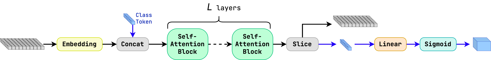
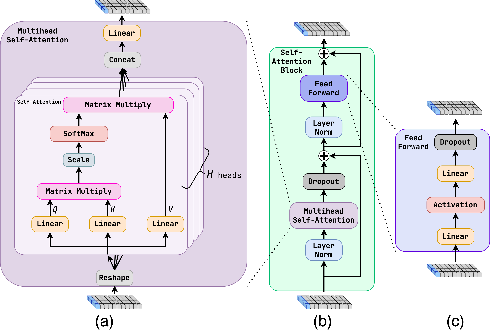

Module jidenn.models.Transformer
================================
Implementation of the Transformer model from the paper "Attention is all you need," see https://arxiv.org/abs/1706.03762.

The model is a stack of self-attention blocks, each of which contains a multi-head self-attention layer and a feed-forward network.
The input features are embedded into a vector of size `dim`, which is then passed through the self-attention blocks.

Classes
-------

`FCEmbedding(embed_dim: int, embed_layers: int, activation: Callable[[tensorflow.python.framework.ops.Tensor], tensorflow.python.framework.ops.Tensor])`
:   Embedding layer as a series of fully-connected layers.
    
    Args:
        embed_dim (int): dimension of the embedding
        embed_layers (int): number of fully-connected layers
        activation (Callable[[tf.Tensor], tf.Tensor]) activation function

    ### Ancestors (in MRO)

    * keras.engine.base_layer.Layer
    * tensorflow.python.module.module.Module
    * tensorflow.python.trackable.autotrackable.AutoTrackable
    * tensorflow.python.trackable.base.Trackable
    * keras.utils.version_utils.LayerVersionSelector

    ### Methods

    `call(self, inputs)`
    :   Forward pass of the embedding layer
        
        Args:
            inputs (tf.Tensor): input tensor of shape `(batch_size, num_particles, num_features)`
        
        Returns:
            tf.Tensor: output tensor of shape `(batch_size, num_particles, embed_dim)`

    `get_config(self)`
    :   Returns the config of the layer.
        
        A layer config is a Python dictionary (serializable)
        containing the configuration of a layer.
        The same layer can be reinstantiated later
        (without its trained weights) from this configuration.
        
        The config of a layer does not include connectivity
        information, nor the layer class name. These are handled
        by `Network` (one layer of abstraction above).
        
        Note that `get_config()` does not guarantee to return a fresh copy of
        dict every time it is called. The callers should make a copy of the
        returned dict if they want to modify it.
        
        Returns:
            Python dictionary.

`FFN(dim: int, expansion: int, activation: Callable[[tensorflow.python.framework.ops.Tensor], tensorflow.python.framework.ops.Tensor], dropout: Optional[float] = None)`
:   Feed-forward network 
    
    Args:
        dim (int): dimension of the input and output
        expansion (int): expansion factor of the hidden layer, i.e. the hidden layer has size `dim * expansion`
        activation (Callable[[tf.Tensor], tf.Tensor]) activation function
        dropout (float, optional): dropout rate. Defaults to None.

    ### Ancestors (in MRO)

    * keras.engine.base_layer.Layer
    * tensorflow.python.module.module.Module
    * tensorflow.python.trackable.autotrackable.AutoTrackable
    * tensorflow.python.trackable.base.Trackable
    * keras.utils.version_utils.LayerVersionSelector

    ### Methods

    `call(self, inputs: tensorflow.python.framework.ops.Tensor) ‑> tensorflow.python.framework.ops.Tensor`
    :   Forward pass of the feed-forward network
        
        Args:
            inputs (tf.Tensor): input tensor of shape `(batch_size, num_particles, dim)`
        
        Returns:
            tf.Tensor: output tensor of shape `(batch_size, num_particles, dim)`

    `get_config(self)`
    :   Returns the config of the layer.
        
        A layer config is a Python dictionary (serializable)
        containing the configuration of a layer.
        The same layer can be reinstantiated later
        (without its trained weights) from this configuration.
        
        The config of a layer does not include connectivity
        information, nor the layer class name. These are handled
        by `Network` (one layer of abstraction above).
        
        Note that `get_config()` does not guarantee to return a fresh copy of
        dict every time it is called. The callers should make a copy of the
        returned dict if they want to modify it.
        
        Returns:
            Python dictionary.

`MultiheadSelfAttention(dim: int, heads: int)`
:   Multi-head self-attention layer
    This layer is a wrapper around the `tf.keras.layers.MultiHeadAttention` layer, 
    to fix the key, value, and query to be the same.
    
    Args:
        dim (int): dimension of the input and output
        heads (int): number of heads

    ### Ancestors (in MRO)

    * keras.engine.base_layer.Layer
    * tensorflow.python.module.module.Module
    * tensorflow.python.trackable.autotrackable.AutoTrackable
    * tensorflow.python.trackable.base.Trackable
    * keras.utils.version_utils.LayerVersionSelector

    ### Methods

    `call(self, inputs: tensorflow.python.framework.ops.Tensor, mask: tensorflow.python.framework.ops.Tensor) ‑> tensorflow.python.framework.ops.Tensor`
    :   Forward pass of the multi-head self-attention layer
        
        Args:
            inputs (tf.Tensor): input tensor of shape `(batch_size, num_particles, dim)`
            mask (tf.Tensor): mask tensor of shape `(batch_size, num_particles, num_particles)`
                This mask is used to mask out the attention of padding particles, generated when
                tf.RaggedTensor is converted to tf.Tensor.
        
        Returns:
            tf.Tensor: output tensor of shape `(batch_size, num_particles, dim)`

    `get_config(self)`
    :   Returns the config of the layer.
        
        A layer config is a Python dictionary (serializable)
        containing the configuration of a layer.
        The same layer can be reinstantiated later
        (without its trained weights) from this configuration.
        
        The config of a layer does not include connectivity
        information, nor the layer class name. These are handled
        by `Network` (one layer of abstraction above).
        
        Note that `get_config()` does not guarantee to return a fresh copy of
        dict every time it is called. The callers should make a copy of the
        returned dict if they want to modify it.
        
        Returns:
            Python dictionary.

`SelfAttentionBlock(dim: int, heads: int, expansion: int, activation: Callable[[tensorflow.python.framework.ops.Tensor], tensorflow.python.framework.ops.Tensor], dropout: Optional[float] = None, *args, **kwargs)`
:   Self-attention block.
    It contains a multi-head self-attention layer and a feed-forward network with residual connections
    and layer normalizations.
    
    Args:
        dim (int): dimension of the input and output
        heads (int): number of heads
        expansion (int): expansion factor of the hidden layer, i.e. the hidden layer has size `dim * expansion`
        activation (Callable[[tf.Tensor], tf.Tensor]) activation function
        dropout (float, optional): dropout rate. Defaults to None.

    ### Ancestors (in MRO)

    * keras.engine.base_layer.Layer
    * tensorflow.python.module.module.Module
    * tensorflow.python.trackable.autotrackable.AutoTrackable
    * tensorflow.python.trackable.base.Trackable
    * keras.utils.version_utils.LayerVersionSelector

    ### Methods

    `call(self, inputs: tensorflow.python.framework.ops.Tensor, mask: tensorflow.python.framework.ops.Tensor) ‑> tensorflow.python.framework.ops.Tensor`
    :   Forward pass of the self-attention block
        
        Args:
            inputs (tf.Tensor): input tensor of shape `(batch_size, num_particles, dim)`
            mask (tf.Tensor): mask tensor of shape `(batch_size, num_particles, num_particles)`
                This mask is used to mask out the attention of padding particles, generated when
                tf.RaggedTensor is converted to tf.Tensor.
        Returns:
            tf.Tensor: output tensor of shape `(batch_size, num_particles, dim)`

`Transformer(layers: int, dim: int, expansion: int, heads: int, activation: Callable[[tensorflow.python.framework.ops.Tensor], tensorflow.python.framework.ops.Tensor], dropout: Optional[float] = None)`
:   Pure Transformer layers without embedding and output layers.
    
    It also creates the class token, which is used to encode the global information of the input,
    by concatenating the class token to the input.
    
    Args:
        layers (int): number of Self-Attention layers
        dim (int): dimension of the input and output
        expansion (int): expansion factor of the hidden layer, i.e. the hidden layer has size `dim * expansion`
        heads (int): number of heads
        activation (Callable[[tf.Tensor], tf.Tensor]) activation function
        dropout (float, optional): dropout rate. Defaults to None.

    ### Ancestors (in MRO)

    * keras.engine.base_layer.Layer
    * tensorflow.python.module.module.Module
    * tensorflow.python.trackable.autotrackable.AutoTrackable
    * tensorflow.python.trackable.base.Trackable
    * keras.utils.version_utils.LayerVersionSelector

    ### Methods

    `call(self, inputs: tensorflow.python.framework.ops.Tensor, mask: tensorflow.python.framework.ops.Tensor) ‑> tensorflow.python.framework.ops.Tensor`
    :   Forward pass of the Transformer layers
        
        Args:
            inputs (tf.Tensor): input tensor of shape `(batch_size, num_particles, dim)`
            mask (tf.Tensor): mask tensor of shape `(batch_size, num_particles)`.
                From the mask, a mask tensor of shape `(batch_size, num_particles, num_particles)`
                is calculated, which is used to mask out the attention of padding particles, generated when
                `tf.RaggedTensor` is converted to `tf.Tensor`. 
        Returns:
            tf.Tensor: output tensor of shape `(batch_size, num_particles, dim)`

    `get_config(self)`
    :   Returns the config of the layer.
        
        A layer config is a Python dictionary (serializable)
        containing the configuration of a layer.
        The same layer can be reinstantiated later
        (without its trained weights) from this configuration.
        
        The config of a layer does not include connectivity
        information, nor the layer class name. These are handled
        by `Network` (one layer of abstraction above).
        
        Note that `get_config()` does not guarantee to return a fresh copy of
        dict every time it is called. The callers should make a copy of the
        returned dict if they want to modify it.
        
        Returns:
            Python dictionary.

`TransformerModel(input_shape: Tuple[None, int], embed_dim: int, embed_layers: int, self_attn_layers: int, expansion: int, heads: int, dropout: float, output_layer: keras.engine.base_layer.Layer, activation: Callable[[tensorflow.python.framework.ops.Tensor], tensorflow.python.framework.ops.Tensor], preprocess: Optional[keras.engine.base_layer.Layer] = None)`
:   Transformer model with embedding and output layers.
    
    The model already contains the `tf.keras.layers.Input` layer, so it can be used as a standalone model.
    
    The input tensor is first passed through the embedding layer, then the Transformer layers, and finally the output layer.
    If the preprocessing layer is not None, the input tensor is first passed through the preprocessing layer before the embedding layer.
    The input to the output layer is the extracted class token.  
    
    Args:
        input_shape (Tuple[int]): shape of the input
        embed_dim (int): dimension of the embedding
        embed_layers (int): number of fully-connected layers in the embedding
        self_attn_layers (int): number of Self-Attention layers
        expansion (int): expansion factor of the hidden layer, i.e. the hidden layer has size `dim * expansion`
        heads (int): number of heads
        dropout (float, optional): dropout rate. Defaults to None.
        output_layer (tf.keras.layers.Layer): output layer
        activation (Callable[[tf.Tensor], tf.Tensor]) activation function used in all the layers
        preprocess (tf.keras.layers.Layer, optional): preprocessing layer. Defaults to None.

    ### Ancestors (in MRO)

    * keras.engine.training.Model
    * keras.engine.base_layer.Layer
    * tensorflow.python.module.module.Module
    * tensorflow.python.trackable.autotrackable.AutoTrackable
    * tensorflow.python.trackable.base.Trackable
    * keras.utils.version_utils.LayerVersionSelector
    * keras.utils.version_utils.ModelVersionSelector